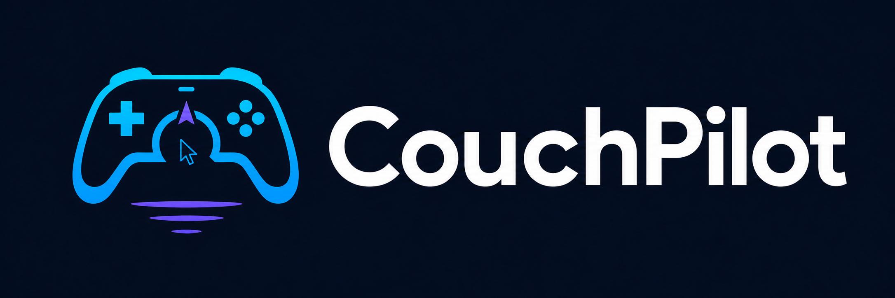

# CouchPilot

<p align="center">
  
</p>

[](https://github.com/wangzhigang1999/couchpilot/actions/workflows/ci.yml)
[](LICENSE)

**[Open the searchable CouchPilot Field Guide →](https://couchpilot-guide.iamzhigangwang.chatgpt.site)**

**Pilot your desktop from a gamepad. Fast, configurable, and cross-platform by design.**

CouchPilot is a small, portable Go program that turns a gamepad into a desktop controller. Windows and XInput are supported today; the core and mapping engine are platform-neutral so additional desktop and device adapters can be added cleanly.

The runtime is a single executable with no Python, C toolchain, or external runtime dependency.

## Run

```powershell
cd D:\couchpilot
.\bin\couchpilot.exe doctor
.\bin\couchpilot.exe start --verbose
.\bin\couchpilot.exe status
```

Stop the background process cleanly:

```powershell
.\bin\couchpilot.exe stop
```

Holding **Back + Start** for 1.5 seconds is still the emergency exit.

## Controls

| Control | Default action |
|---|---|
| Left stick | Immediate, continuous pointer movement |
| Right stick | Scroll |
| D-pad | Arrow keys |
| A | Left click; hold while moving the left stick to drag or select |
| B | Back (`Alt+Left`) |
| X | Right click; supports right-button drag |
| Y | Tap physical right Alt for voice input |
| LT | Precision pointer speed |
| RT | Boost pointer speed |
| LT + M1 / RB | Next Windows window |
| LT + M2 / LB | Previous Windows window |

Haptic feedback is enabled by default: clicks use a light tick, navigation uses a short pulse, voice activation is more noticeable, and window switching/commit uses the strongest confirmation. Controller connection also produces one short pulse.

Codex keeps its task, command-menu, terminal and Back mappings. X remains right click in Codex so it cannot accidentally stop a response. Browsers keep tab, address-bar and new-tab mappings. The LT window shortcuts take priority without changing a shoulder button pressed by itself.

For multiple windows, keep LT held, tap M1/RB or M2/LB repeatedly to move through the native window switcher, then release LT to select the highlighted window.

### Built-in app profiles

CouchPilot identifies the foreground executable and applies a small, safe profile. Mouse movement, scrolling, right-click, voice input, and LT window switching remain available everywhere.

| Apps | LB / RB | L3 | R3 | Special |
|---|---|---|---|---|
| Codex | Previous / next task | Command menu | Terminal | B goes back; X stays right-click |
| Chrome, Edge, Firefox | Previous / next tab | Address bar | New tab | B navigates back |
| Raycast | Selection up / down | — | — | A confirms; B dismisses |
| Typora, Obsidian | Previous / next tab | Find | New document | No automatic input focus |
| VS Code | Previous / next tab | Command palette | Quick open | B dismisses |
| PyCharm, IntelliJ, GoLand | — | Find | — | B dismisses |
| QQ, WeChat | — | Find | — | B dismisses; A never auto-sends |
| Claude, Cherry Studio | — | Find | — | B dismisses |
| QQ Music, Spotify, VLC | Previous / next track | Mute | Play / pause | Uses Windows media keys |
| Acrobat, Word, Excel, PowerPoint | Page up / down | Find | — | — |
| Windows Terminal | Previous / next tab | Command palette | New tab | B dismisses |
| Typeless | — | — | — | B dismisses; Y still uses right Alt |

## Configuration and future UI

`config.json` is the stable configuration contract for the CLI and a future UI. A UI only needs to validate and edit this file; the engine remains unchanged.

Set `haptics_enabled` to `false` to disable vibration, or adjust `haptic_strength` from `0.0` to `2.0`. The default is `1.0`.

Bindings are optional overrides grouped by foreground-app profile. `app_profiles` controls which executable selects each profile; matching is case-insensitive, list items are alternatives, and `process_names` plus `path_contains` can disambiguate executables with the same name. Earlier rules win.

```json
{
  "app_profiles": [
    {
      "name": "notes",
      "process_names": ["Typora.exe", "Obsidian.exe"]
    }
  ],
  "bindings": {
    "default": {
      "a": "click_left",
      "lt+rb": "window_next"
    },
    "notes": {
      "rb": "tab_next",
      "l3": "find"
    }
  }
}
```

Set an action to an empty string to disable that exact binding. Run the following command to list valid action names:

```powershell
.\bin\couchpilot.exe actions
```

The current gesture names are `a`, `b`, `x`, `y`, `lb`, `rb`, `l3`, `r3`, `dpad_up`, `dpad_down`, `dpad_left`, and `dpad_right`. Prefix a gesture with `lt+` or `rt+` for a trigger chord. The supplied `config.json` contains the full editable profile list.

To check which profile CouchPilot sees for the foreground app, focus that app and run:

```powershell
.\bin\couchpilot.exe profile
```

## Architecture

- `internal/core`: platform-neutral device state, actions and narrow interfaces.
- `internal/engine`: pointer math, edge detection, profiles and configurable binding resolution.
- `internal/platform/windows`: XInput and Windows desktop output.
- `internal/platform`: platform factory; a future macOS adapter can implement the same interfaces.
- `internal/config`: versioned JSON schema shared by the CLI and future UI.

This is intentionally an adapter boundary, not a plugin framework. Additional gamepads or desktop platforms can be added without changing the mapping engine.

## Build

```powershell
powershell -ExecutionPolicy Bypass -File .\scripts\build.ps1
```

The script uses project-local Go caches, runs tests and static checks, then creates `bin\couchpilot.exe`. The executable has no Go, Python, or C runtime dependency to install.

## Contributing and license

Contributions are welcome. Read [CONTRIBUTING.md](CONTRIBUTING.md) before changing platform boundaries or the public configuration schema.

Released under the [MIT License](LICENSE).
