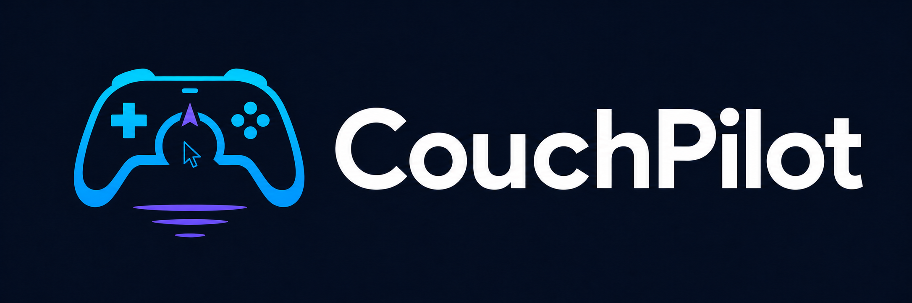

# CouchPilot

<p align="center">
  
</p>

[](https://github.com/wangzhigang1999/couchpilot/actions/workflows/ci.yml)
[](LICENSE)

**[Open the searchable CouchPilot Field Guide →](https://wangzhigang1999.github.io/couchpilot/)**

**Pilot your desktop from a gamepad. Fast, configurable, and cross-platform by design.**

CouchPilot is a small, portable Go program that turns a gamepad into a desktop controller. Windows/XInput and macOS game controllers are supported today; the core and mapping engine remain platform-neutral.

The runtime is a single executable with no Python, C toolchain, or external runtime dependency.

## Downloads

Every successful build on `main` refreshes the rolling
[latest development release](https://github.com/wangzhigang1999/couchpilot/releases/tag/latest)
with Windows x64, macOS Apple Silicon and macOS Intel packages. Versioned
releases are created automatically by pushing a semantic tag such as
`v0.2.0`; the newest versioned release is also exposed through
[GitHub's stable latest link](https://github.com/wangzhigang1999/couchpilot/releases/latest).
Each release includes `SHA256SUMS.txt`.

## Run

```powershell
cd <path-to-couchpilot>
.\bin\couchpilot.exe doctor
.\bin\couchpilot.exe start --verbose
.\bin\couchpilot.exe status
```

When CouchPilot is running on Windows, its small controller icon appears in
the notification area. Right-click it to open logs or configuration, or exit
CouchPilot cleanly. Windows may
place a new icon under the notification-area overflow arrow the first time it
runs.

You can also double-click `couchpilot.exe`: Explorer launches it directly in
the background without leaving a console window open. Running the same file
from PowerShell keeps the normal terminal behavior and output.

Stop the background process cleanly:

```powershell
.\bin\couchpilot.exe stop
```

Holding **Back + Start** for 1.5 seconds is still the emergency exit.

## Local diagnostic trace

CouchPilot can append a small diagnostic fact for each physical activation or
resolved action to `trace/trace.jsonl` beside `config.json`. Each line is one
JSON object containing the timestamp, foreground executable's base name,
matched profile, physical control, resolved action and dispatch outcome. It
does not record typed text, window titles, full process paths, controller IDs
or pointer coordinates, and nothing is uploaded.

This file is deliberately not a statistics feature: there is no report,
dashboard, recommendation engine, aggregation database or tray menu for it.
It exists only for inspecting a mapping or dispatch problem. Set
`local_trace_enabled` to `false` to stop appending new lines. The single file
is capped at 8 MiB; when the next line would exceed that limit, CouchPilot
clears it and starts again instead of creating rotations or backups.

## Controls

| Control | Default action |
|---|---|
| Left stick | Immediate, continuous pointer movement |
| Right stick | Scroll |
| D-pad | Arrow keys |
| A | Left click; hold while moving the left stick to drag or select |
| B | Back (`Alt+Left`) |
| X | Right click; supports right-button drag |
| Y | Voice input: Fn on macOS, right Alt on Windows |
| Y, then A | Press Enter in the current app |
| LT | Precision pointer speed |
| RT | Boost pointer speed |
| RT + A | Enter / confirm immediately, in every app |
| RT + B | Backspace once per press |
| RT + X | Escape / cancel |
| RT + Y | Find (Ctrl+F on Windows, Command+F on macOS) |
| LT + M1 / RB | Next Windows window |
| LT + M2 / LB | Previous Windows window |

On macOS, RB/LB use Control+Tab and Control+Shift+Tab for tab navigation;
holding LT changes them to Command+Tab window switching. On Windows the
corresponding shortcuts remain Control+Tab and Alt+Tab.

Haptic feedback is enabled by default: clicks use a light tick, navigation uses a short pulse, voice activation is more noticeable, and window switching/commit uses the strongest confirmation. Controller connection also produces one short pulse.

Codex keeps its task, command-menu, terminal and Back mappings. X alone remains right click in Codex; RT+X deliberately sends Escape and may stop a response. Browsers keep tab, address-bar and new-tab mappings. The LT window shortcuts take priority without changing a shoulder button pressed by itself.

Hold RT before pressing A/B/X/Y. Each editing chord runs once per press, without auto-repeat, and exits CouchPilot's temporary voice-edit state. RT+A does not require Y or the two-second voice delay; it sends Enter to the currently focused control. RT alone still boosts pointer speed. If both triggers are held, LT takes priority. Changing a trigger while a button is already held does not reinterpret that press; release and press the button again.

For multiple windows, keep LT held, tap M1/RB or M2/LB repeatedly to move through the native window switcher, then release LT to select the highlighted window.

### Built-in app profiles

CouchPilot identifies the foreground executable and applies a small, safe profile. Mouse movement, scrolling, right-click, voice input, and LT window switching remain available everywhere.

| Apps | LB / RB | L3 | R3 | Special |
|---|---|---|---|---|
| Codex | Previous / next task | Command menu | Terminal | B goes back; X stays right-click |
| Chrome, Edge, Firefox | Previous / next tab | Address bar | New tab | B navigates back |

## Configuration and future UI

`config.json` is the stable configuration contract for the CLI and a future UI. A UI only needs to validate and edit this file; the engine remains unchanged.

Set `haptics_enabled` to `false` to disable vibration, or adjust `haptic_strength` from `0.0` to `2.0`. The default is `1.0`.

Set `local_trace_enabled` to `false` to disable the local JSONL diagnostic
trace described above. This setting never enables network upload.

`voice_key` defaults to `platform_default`: Y sends Fn on macOS and right Alt
on Windows. Explicit `right_alt` and `left_alt` remain available on both
platforms; macOS also accepts `fn`.

`voice_submit_min_delay_seconds` is the minimum pause after `Y` before `A` can submit; it defaults to two seconds because CouchPilot triggers the operating system's voice input but does not receive microphone or VAD events. An earlier `A` press is ignored instead of clicking or sending. `voice_submit_timeout_seconds` controls how long the global voice-submit state remains armed. Moving the pointer, changing apps, pressing another control, submitting, or reaching the timeout restores A to its normal mouse action. Codex additionally lets unmodified `B` delete one character or repeat while held. `RT+A` sends Enter immediately in every app, while `RT+B` always performs only one Backspace per press.

Bindings are optional overrides grouped by foreground-app profile. `app_profiles` controls which executable selects each profile; matching is case-insensitive, list items are alternatives, and `process_names` plus `path_contains` can disambiguate executables with the same name. Earlier rules win.

```json
{
  "app_profiles": [
    {
      "name": "chrome",
      "process_names": ["chrome.exe", "Google Chrome"]
    }
  ],
  "bindings": {
    "default": {
      "a": "click_left",
      "voice+a": "enter",
      "rt+a": "enter",
      "rt+b": "backspace",
      "rt+x": "escape",
      "rt+y": "find",
      "lt+rb": "window_next"
    },
    "chrome": {
      "rb": "tab_next",
      "l3": "focus_location"
    },
    "codex": {
      "voice+b": "backspace"
    }
  }
}
```

Set an action to an empty string to disable that exact binding. A disabled trigger chord does nothing instead of falling back to its base button; an unassigned chord still falls back. Run the following command to list valid action names:

```powershell
.\bin\couchpilot.exe actions
```

The current gesture names are `a`, `b`, `x`, `y`, `lb`, `rb`, `l3`, `r3`, `dpad_up`, `dpad_down`, `dpad_left`, and `dpad_right`. Prefix a gesture with `lt+` or `rt+` for a trigger chord. `voice+a` is the global contextual Enter gesture after Y; `voice+b` remains Codex's contextual, repeatable Backspace. The supplied `config.json` contains the editable Codex and Chrome profiles; all other apps use the `default` bindings.

Only one trigger prefix is supported; `voice+a` and `voice+b` are separate sequences and cannot take an additional prefix. Back and Start are reserved for emergency exit. Unsupported gesture names are rejected when loading configuration instead of silently doing nothing. Custom `voice+b` actions follow normal action semantics: mouse clicks can be held, voice respects `voice_mode`, and only Backspace auto-repeats. Switching apps cancels the voice sequence even while the gamepad is idle; returning to the original app does not restore it.

To check which profile CouchPilot sees for the foreground app, focus that app and run:

```powershell
.\bin\couchpilot.exe profile
```

## Architecture

- `cmd/couchpilot`: process supervision; native UI stays on the main thread and the engine runs as a worker.
- `internal/core`: stable platform-neutral device state, semantic actions and narrow runtime interfaces.
- `internal/mapping`: built-in bindings, user overrides, fallback rules and foreground-app profile matching.
- `internal/desktop`: the single semantic-action executor. It expands actions into logical keys, chords and the few operations that genuinely need OS-specific behavior.
- `internal/engine`: the controller runtime, split into device selection, pointer/scroll processing, gesture dispatch, voice/window sessions and runtime diagnostics.
- `cmd/couchpilot`: application assembly, including conversion from persisted settings to the engine's runtime options. The engine does not import `internal/config`.
- `internal/trace`: append-only local JSONL diagnostics.
- `internal/platform/windows`: XInput plus translation of logical desktop operations to Windows input.
- `internal/platform/macos`: GameController/IOHID plus translation of logical desktop operations to CoreGraphics.
- `internal/platform`: build-tagged composition root that wraps a platform driver with the shared action executor and profile matcher.
- `internal/tray`: a shared lifecycle contract with native Windows and macOS implementations.
- `internal/config`: versioned JSON schema shared by the CLI and future UI.

This is intentionally an adapter boundary, not a plugin framework. A new
desktop platform implements logical key/chord translation, mouse, voice,
media, window switching and foreground-app discovery, then registers those
drivers in a build-tagged factory. Binding profiles and ordinary shortcut
actions do not need to be copied into the new adapter.

## Build

```powershell
powershell -ExecutionPolicy Bypass -File .\scripts\build.ps1
```

The script uses project-local Go caches, runs tests and static checks, then creates `bin\couchpilot.exe`. The executable has no Go, Python, or C runtime dependency to install.

### macOS

Build the native Apple Silicon executable on a Mac:

```sh
./scripts/build-macos.sh
./bin/CouchPilot.app/Contents/MacOS/CouchPilot doctor --config config.json
./bin/CouchPilot.app/Contents/MacOS/CouchPilot start --config config.json --verbose
```

The build creates both a raw CLI executable and `bin/CouchPilot.app`. Use the
executable inside the application bundle for normal macOS operation so AppKit
can register CouchPilot as a menu-bar application. Double-clicking the app uses
`~/Library/Application Support/CouchPilot/config.json`; command-line `--config`
still supports a portable configuration elsewhere.

The macOS adapter uses Apple's GameController API with an IOHID fallback for
Xbox-compatible USB receivers, and CoreGraphics for desktop input. On first
use, CouchPilot requests **System Settings → Privacy & Security →
Accessibility** access and exits instead of pretending input was sent. Grant
access, then start it again. While running, a monochrome controller icon
appears in the macOS menu bar. Its
menu opens logs or the configuration folder and can exit CouchPilot cleanly.
AppKit and GameController share one process: AppKit
owns the main thread while the mapping engine samples background controller
state on a worker.

Controller haptics are currently implemented on Windows. macOS controllers
work without rumble when their driver does not expose a compatible haptics API;
`doctor` reports this as a skipped capability instead of a successful pulse.

The script ad-hoc signs local builds by default. For a stable distributable
identity, provide an installed signing identity:

```sh
CODESIGN_IDENTITY='Developer ID Application: Example (TEAMID)' ./scripts/build-macos.sh
```

The default deployment target is macOS 11.0. Override both the compiled binary
and bundle metadata together with `MACOSX_DEPLOYMENT_TARGET` when needed.

## Contributing and license

Contributions are welcome. Read [CONTRIBUTING.md](CONTRIBUTING.md) before changing platform boundaries or the public configuration schema.

Released under the [MIT License](LICENSE).
